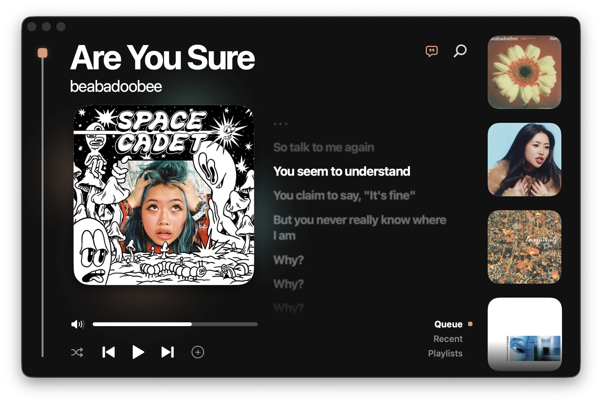
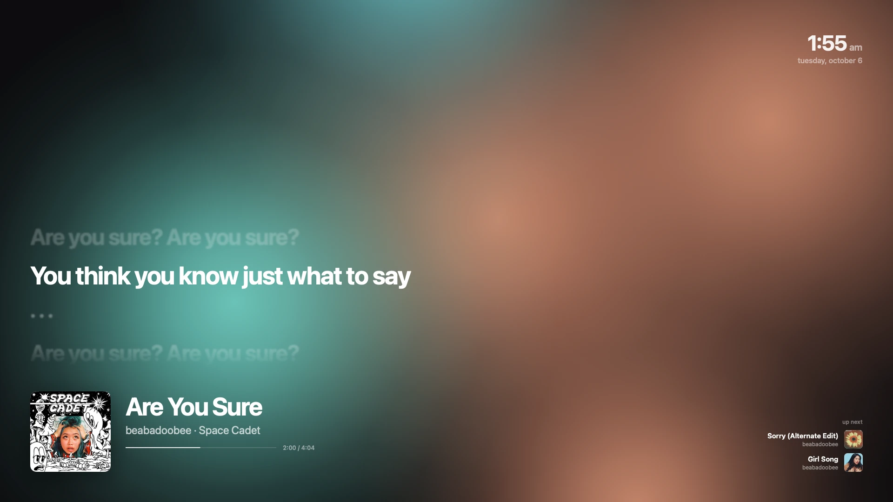

# Medtner, a lightweight Spotify player



medtner was made to increase performance times while still giving you all the features you need. 
it has:
- searching
- queue management
- playlists, albums and liked songs
- synced lyrics
- a full screen mode made for a second monitor
- menu bar controls, media keys and Control Center
- ambient animations that move with the music

it idles at 0% CPU and stays under 100 MB of memory. the Spotify app never has to open.



## install

paste this into Terminal:

```sh
curl -fsSL https://raw.githubusercontent.com/nesetkab/medtner/main/install.sh | sh
```

it downloads the latest release, puts Medtner in your Applications folder, and opens it. no "unidentified developer" popup, no Homebrew, nothing else to install. the Spotify app doesn't need to be installed or open.

you need:
- a Mac with Apple silicon (M1 or newer)
- macOS 15 Sequoia or newer
- Spotify Premium

## connect spotify (one time, about 2 minutes)

Spotify doesn't let apps like this share one login, so you make your own free Spotify developer app. Medtner walks you through it when it opens:

1. go to [developer.spotify.com/dashboard](https://developer.spotify.com/dashboard/create) and log in with your Spotify account
2. click **Create app**. name and description can be anything
3. under **Redirect URIs**, paste `http://127.0.0.1:8973/callback` and click **Add** (Medtner has a copy button for this)
4. tick **Web API**, agree to the terms, and click **Save**
5. copy the **Client ID** from the app's page, paste it into Medtner, and click **Continue**
6. your browser asks you to approve Medtner. click **Agree**
7. your browser asks one more time, this time for Medtner's speaker (it plays the audio itself). approve that too

that's it. Medtner remembers everything, so you won't see these steps again.

## using it

- **space** plays and pauses, **← →** skip, **↑ ↓** change volume, **/** searches, **s** toggles shuffle
- click the **+** after the skip button to save a song to Liked Songs, click it again to add it to a playlist
- right-click any song for Add to Queue, Save to Liked Songs and Add to Playlist
- click a tile on the right to open a playlist or album, and click it again to close it
- the speech bubble next to search turns lyrics on and off. click a lyric line to jump there
- click the green button in the corner for full screen. move the mouse to bring up every control, press **esc** to leave
- your keyboard's media keys, AirPods and Control Center control Medtner too
- the equalizer in your menu bar is a mini controller. closing the window keeps Medtner running there

## update

run the install command again. your login is kept.

## uninstall

```sh
curl -fsSL https://raw.githubusercontent.com/nesetkab/medtner/main/install.sh | sh -s uninstall
```

add `--all` after `uninstall` to also remove your saved login and cache.

## troubleshooting

- **"Sign in didn't finish"**: check the Client ID, and that the redirect URI in your Spotify app is exactly `http://127.0.0.1:8973/callback`
- **nothing plays**: press play once in Medtner. it wakes up its speaker and resumes where you left off
- **the Dock icon looks black in Finder or Launchpad**: that's macOS's dark icon style. the Dock shows the real icon while Medtner is running
- **playlist songs don't show up**: Spotify only lets developer apps list songs in playlists you own. you can still play other playlists
- **no lyrics for a song**: lyrics come from [LRCLIB](https://lrclib.net), a free lyrics database. some songs aren't in it yet

## build from source

needs the Xcode Command Line Tools (`xcode-select --install`) and librespot (`brew install librespot`).

```sh
./scripts/build.sh install
```

## credits

audio playback uses [librespot](https://github.com/librespot-org/librespot) (MIT), bundled inside the app. lyrics come from [LRCLIB](https://lrclib.net). Medtner isn't affiliated with Spotify.
